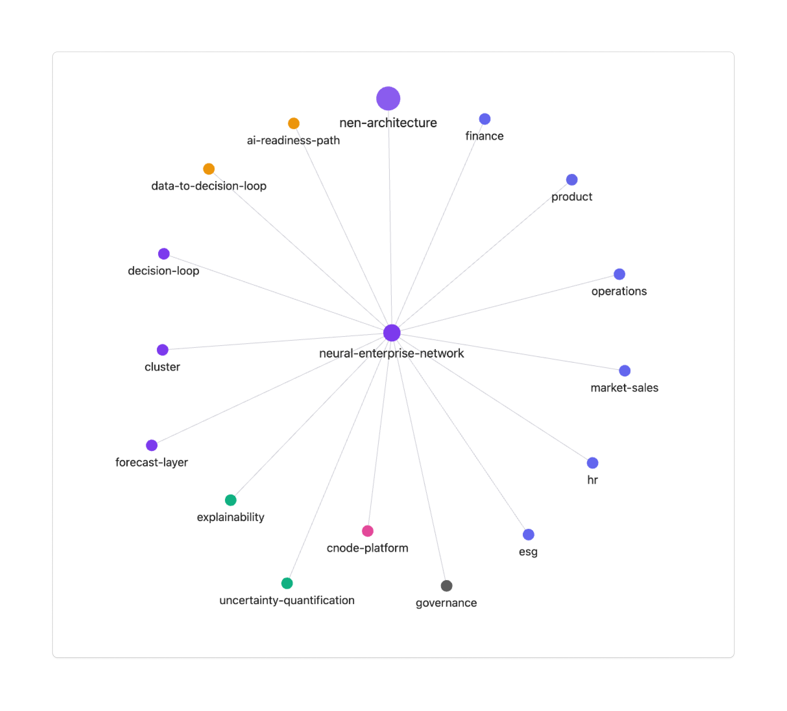

# Outline — Paper 1: "The Neural Enterprise Network (NEN): A Cluster-Based Architecture for Organizational Decision Intelligence"
**Repository:** creativate-research  
**Version:** v0.1.1  
**Timestamp:** 2025-10-30  
**Authors:** Leonardo Bornhäußer, Tuna [R&D Lead], Creativate Research Group  
**DOI:** _to be filled once Zenodo release is created_  

---

## 1. Motivation & Research Context
Organizations increasingly rely on machine learning for forecasting, planning, and decision support — yet current architectures treat these as isolated models per domain (Finance, Operations, HR, etc.).  
This paper introduces the **Neural Enterprise Network (NEN)**, a cluster-based architecture that unifies these domains into an **organizational decision intelligence network** with **explainability** and **uncertainty awareness** by design.

### Core problems addressed
- Lack of inter-domain learning (organizational silos)
- Missing explainability across decision layers
- Insufficient uncertainty calibration for financial & operational planning
- Need for architecture that complies with AI governance (EU AI Act, CSRD)

---

## 2. Concept: Neural Enterprise Network (NEN)
**Definition:**  
The NEN is a **multi-cluster decision architecture**, where each cluster represents an organizational domain (Finance, Operations, HR, ESG, Product, Market/Sales).  
Clusters interact via a shared **Forecast Layer** and a **Haloframe Governance System**, enabling:
- **Cross-domain transfer** of predictive and causal insights  
- **Explainability propagation** across management layers  
- **Uncertainty quantification** embedded in decision rules

### Figure 1 — Architecture Overview
  
*Knowledge-graph representation of the NEN, exported from the Creativate Obsidian research vault.*

---

## 3. Methodology & Design Principles
| Layer | Component | Description |
|--------|------------|-------------|
| **Conceptual** | NEN, Clusters, Forecast Layer | Defines the structural model of decision intelligence. |
| **Technical** | cNode Platform, Haloframe Governance | Implements model orchestration, lineage, explainability, and auditability. |
| **Analytical** | Explainability, Uncertainty Quantification | Integrates SHAP/LIME reasoning with probabilistic forecasts (ECE, CRPS). |
| **Process** | Data→Decision Loop, AI Readiness Path | Defines how organizations evolve toward AI-native operations. |

### Research questions
1. How can a cluster-based architecture enhance **cross-domain learning** without data leakage?  
2. How can explainability and uncertainty quantification be integrated as **first-class architectural elements**?  
3. How can governance be implemented as an **active system layer** (not just a policy add-on)?  

---

## 4. Experimental Design (Planned)
- **Prototype:** cNode platform v0.1  
- **Datasets:** Synthetic & anonymized enterprise metrics (Finance, HR, Operations)  
- **Metrics:** MAE, SMAPE, ECE (Expected Calibration Error), CRPS (probabilistic)  
- **Baselines:** Independent models vs. shared cluster model  
- **Toolkit:** `oss-eval` (open-sourced as part of this repo)

---

## 5. Expected Contributions
- Novel **architectural pattern** bridging ML and organizational design  
- Open-source **evaluation toolkit** for uncertainty-aware decision models  
- Conceptual framework for **AI governance by design**  
- Synthetic dataset + reproducible metrics for benchmarking  

---

## 6. Relation to Second Paper
This paper establishes the **architectural theory**.  
The follow-up (“Cluster-Governed Forecasting for Financial Planning under Uncertainty”) will present empirical validation on **financial forecasting** and extend the evaluation toolkit.

---

## 7. Publication Plan
| Venue | Type | Target | Status |
|--------|------|---------|--------|
| NeurIPS Workshop – AI for Decision Making | Workshop Paper | 4 pages | Draft in progress |
| Frontiers in AI – Trustworthy AI | Journal | 8–10 pages | Submission Q1 2026 |
| Zenodo / arXiv | Preprint | DOI ownership | v0.1.1 (this outline + figure) |

---

## 8. Next Steps (Tuna – R&D Lead)
1. Formalize Sections 2–3 as scientific paper (Typst → PDF)  
2. Expand methodology: define mathematical formulation of NEN  
3. Run first synthetic experiment (Finance & HR clusters)  
4. Commit results to `internal/` and publish non-sensitive metrics here  
5. Prepare abstract + related work for NeurIPS submission  
6. Tag and release `v0.1.2` (DOI update)
